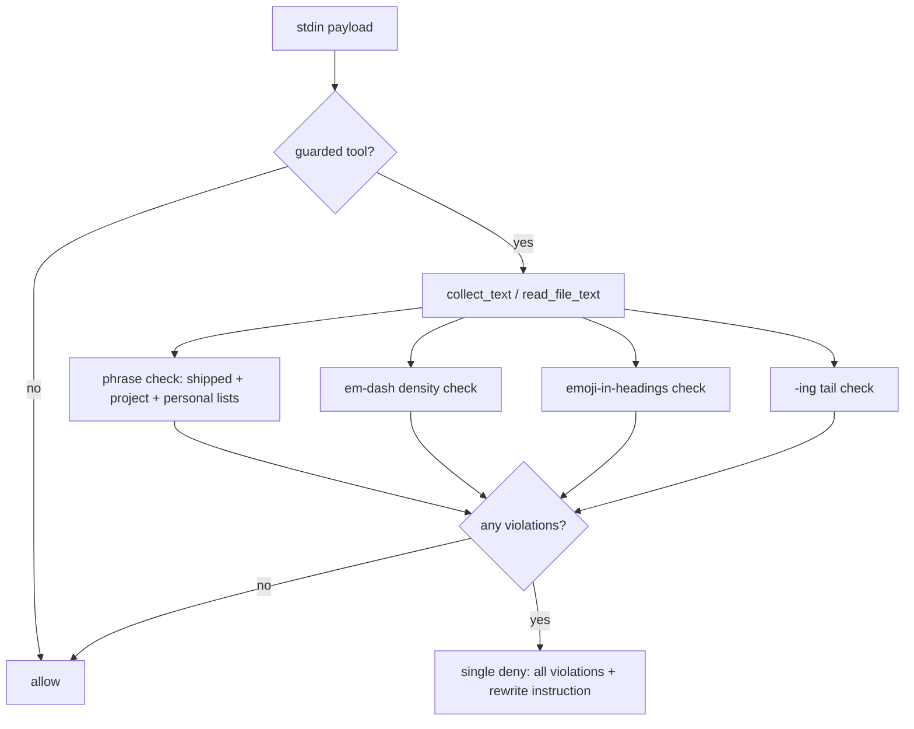

# feat: Generalize the A3 copy rules into the guard

## Summary

Extend the deterministic hook with an em-dash density check, supplemental project-local and personal phrase files, five puffery phrases, an emoji-in-headings check, and a superficial-analysis `-ing`-tail check — all deny-only — and add five new judgment patterns to the manual skill. Refactor the guard's single-check flow into a violations pipeline so every firing check reports in one deny. Version 0.1.3 → 0.2.0.

---

## Problem Frame

The hook's deterministic layer is exact-phrase-only. A day of real marketing-copy writes (~26 guarded Notion calls) passed untouched while the human reviewer repeatedly flagged density and structural problems — em-dash clusters above all. Project vocabulary deny-lists produced by that effort have no enforcement home. Full framing in the origin doc (see origin: docs/brainstorms/2026-07-31-a3-rules-generalization-requirements.md).

---

## Requirements

Carried from origin: R1 (em-dash density, deny with counts), R2 (project + personal phrase files, silent-skip when missing, source named in the deny), R3 (five puffery phrases), R4 (emoji in markdown headings), R5 (`-ing` analysis tails, narrow list), R7 (fixtures per check and per payload field shape), R8–R12 (manual-skill patterns), R13 (version bump). R6 landed upstream in 0.1.3. Acceptance examples AE1–AE3 carried into unit test scenarios.

---

## Key Technical Decisions

- **Violations pipeline over first-hit deny.** `main()` collects text once, runs every check, and emits a single deny listing all violations. One rewrite round fixes everything instead of serial deny→rewrite→deny loops. The existing deny-message rewrite instruction stays, stated once.
- **Em-dash thresholds as module constants, fixture-validated.** A single em-dash always passes (resolves origin AE1's pass case). Deny when the em-dash count is 2+ and denser than roughly one per 350 characters of collected text, or any single paragraph carries 3+. Constants sit at the top of the guard next to `CONTENT_KEYS` so tuning is a one-line edit; fixtures pin both firing and passing cases including a long document with two sparse dashes (allow).
- **Supplemental phrase files ride the existing loader.** Project file `.no-ai-slop-phrases.txt` resolved from `CLAUDE_PROJECT_DIR` (env exposed to hooks) with fallback to the payload's `cwd` field; personal file `~/.claude/no-ai-slop-phrases.local.txt` via `expanduser` (tests override `HOME`). `load_lines` already returns `[]` on missing files — silent skip comes free. Hits carry their source list in the deny ("project list" / "personal list" / shipped).
- **"reflecting" stays out of the `-ing` word list.** Highest false-positive risk of the candidate set (legitimate technical prose: "reflecting the viewer's theme"). List ships as `highlighting, underscoring, showcasing, demonstrating, signaling` — a module constant, trivially shrinkable. Resolves the origin's deferred question.
- **Emoji detection scoped to heading lines.** Only lines matching a markdown heading prefix are scanned for emoji ranges (U+1F300–U+1FAFF, U+2600–U+27BF, U+FE0F). Body emoji stay legal; Slack messages without heading syntax are untouched.

---

## High-Level Technical Design

---

## Implementation Units

### U1. Violations pipeline + em-dash density check

- **Goal:** Guard runs an ordered check list and denies once with all violations; first new check is em-dash density.
- **Requirements:** R1; AE1.
- **Dependencies:** none.
- **Files:** `hooks/no-ai-slop-guard.py`, `tests/test_guard.sh`.
- **Approach:** Extract the current phrase check into the first entry of a check pipeline returning violation strings. Add the density check per the KTD (constants, chunk = full collected text, paragraph split on blank lines). Deny message begins with the violation list, then the existing rewrite instruction verbatim.
- **Patterns to follow:** existing `find_hits` + `deny` structure; test fixtures in `tests/test_guard.sh` (`check <name> <expected> <json>`).
- **Test scenarios:**
  - Covers AE1. Notion `replace_content` payload, four em-dashes in one paragraph → deny, reason contains the count.
  - Same payload with one em-dash → allow.
  - Long text (>1500 chars) with two widely-spaced em-dashes → allow (density under threshold).
  - Slack message, 200 chars, two em-dashes → deny (short-copy density).
  - Payload with both a slop phrase and dense em-dashes → one deny naming both violations.
- **Verification:** `tests/test_guard.sh` passes with the new fixtures; existing 22 checks still pass.

### U2. Project-local + personal phrase files

- **Goal:** Guard loads supplemental deny phrases from the working project and the user's config dir, naming the source list on hits.
- **Requirements:** R2; AE2.
- **Dependencies:** U1 (pipeline shape).
- **Files:** `hooks/no-ai-slop-guard.py`, `tests/test_guard.sh`.
- **Approach:** Resolve project dir from `CLAUDE_PROJECT_DIR` env, falling back to the payload's `cwd` key; personal path under `~/.claude` via `expanduser`. Update the guard docstring's data-files note.
- **Test scenarios:**
  - Covers AE2. `CLAUDE_PROJECT_DIR` pointing at a fixture dir whose `.no-ai-slop-phrases.txt` contains `earn-and-burn`; Slack payload with that phrase → deny naming the project list.
  - Same payload, no project file present → allow.
  - `HOME` pointed at a fixture dir with a personal file phrase → deny naming the personal list.
  - Payload `cwd` fallback works when the env var is absent.
- **Verification:** new fixtures pass; a phrase in the shipped list still reports without a source suffix (or as "shipped") consistently.

### U3. Puffery phrases + emoji-in-headings + -ing tails

- **Goal:** Land the remaining deterministic checks.
- **Requirements:** R3, R4, R5; AE3.
- **Dependencies:** U1.
- **Files:** `hooks/slop-phrases.txt`, `hooks/no-ai-slop-guard.py`, `tests/test_guard.sh`.
- **Approach:** Append the five puffery phrases to the shipped list (existing word-boundary matcher covers multiword). Add the heading-emoji and `-ing`-tail checks to the pipeline per the KTDs.
- **Test scenarios:**
  - "stands as a testament" in a Gmail body → deny (phrase list picks it up with zero code change).
  - Markdown content with `## 🚀 Launch plan` heading → deny; same emoji in body text → allow.
  - ", highlighting the team's commitment" → deny; "highlighting" as sentence subject ("Highlighting matters") → allow; ", reflecting the viewer's theme" → allow (word excluded).
  - Covers AE3. Phrase-clean but em-dash-dense draft with a project file present → deny reports density only, no phrase hit claimed.
- **Verification:** full suite passes; deny messages name each check type distinctly.

### U4. Manual-skill judgment patterns

- **Goal:** The five A3-born patterns land in the manual skill where structural judgment lives.
- **Requirements:** R8–R12.
- **Dependencies:** none (parallel-safe with U1–U3).
- **Files:** `skills/no-ai-slop/SKILL.md`.
- **Approach:** Add to "Patterns to cut": circular definitions (R8), bold-label fragments (R9), claim hammering (R10). Add to "Editing principles": never extend a source claim into an adjacent mechanism claim — ask (R11). Extend the existing em-dash entry's neighborhood with paren-aside preference and stats-read-as-formal-sentences notes (R12). Match the file's existing voice: pattern name, one-line diagnosis, before→after example where the pattern benefits.
- **Test scenarios:** Test expectation: none — prose-only skill content; correctness is editorial (checked in U5's read-through).
- **Verification:** each new pattern names the shape, the fix, and stays consistent with the hook/skill layering note at the top of the file.

### U5. Version bump, README, full-suite verification

- **Goal:** Ship-ready: version 0.2.0, docs current, all tests green.
- **Requirements:** R13, R7 closure.
- **Dependencies:** U1–U4.
- **Files:** `.claude-plugin/plugin.json`, `plugin.json` (if it carries a version field), `README.md`, `tests/test_guard.sh`.
- **Approach:** Bump version(s) to 0.2.0. README gains a short section on the new checks and the two supplemental phrase-file paths. Confirm the R7 payload-shape matrix: at least one fixture per content field shape the new checks read (`text`, `body`, `content`, `new_str`, `content_updates[].new_str`, `pages[].content`, Artifact file body).
- **Test scenarios:**
  - Full `tests/test_guard.sh` run: zero failures.
  - Grep the fixture list to confirm each payload field shape above appears at least once.
- **Verification:** suite output pasted in the PR; version fields consistent.

---

## Scope Boundaries

- Deny-only; no advisory channel, no per-surface thresholds (revisit on real false positives).
- No structural auto-deny beyond the two narrow checks; binary contrasts, negative listing, colon reveals stay manual (approved-copy counter-example in origin).
- No repetition/claim-hammering detection in the hook.
- The site-copy claims checker (ploy-scrub) is separate, unplanned work.

### Deferred to Follow-Up Work

- Plugin-update flow for the live install (`claude plugin update` + session restart to re-register hooks) — operational step after merge, not repo work.

---

## Risks

- **False positives on the new checks silently rewriting real content.** Mitigation: thresholds tuned against fixtures including allow-cases drawn from real approved copy; `-ing` list ships narrow; emoji check scoped to heading lines only.
- **`CLAUDE_PROJECT_DIR` not set in some hook contexts.** Mitigation: `cwd` payload fallback, and a missing file is always a silent allow — degradation is toward the old behavior, never toward blocking.

---

## Sources & Research

- `hooks/no-ai-slop-guard.py` — check flow, `CONTENT_KEYS`, `load_lines` silent-skip, deny contract.
- `tests/test_guard.sh` — fixture harness pattern; 22 existing checks including the 0.1.3 `new_str` coverage.
- `skills/no-ai-slop/SKILL.md` — layering note ("the hook can't grep deterministically"), existing em-dash guidance the R1 thresholds mirror.
- Origin: docs/brainstorms/2026-07-31-a3-rules-generalization-requirements.md.
