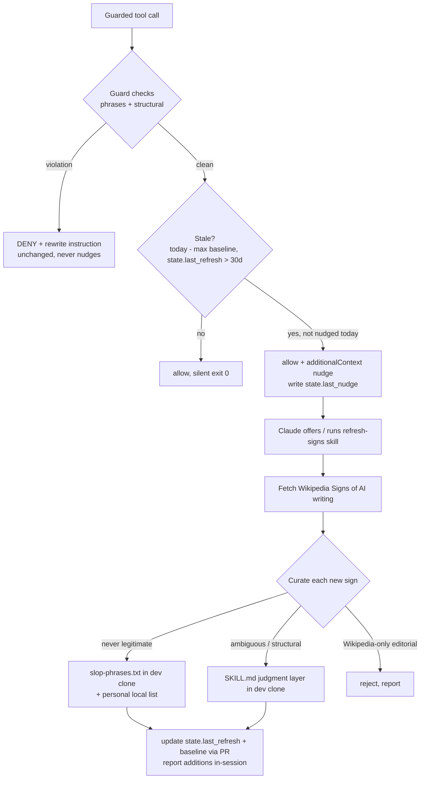

# feat: Wikipedia Signs-of-AI-writing periodic refresh

## Summary

Give the deterministic slop guard a way to stay current: a staleness nudge inside the existing PreToolUse hook (pure date compare, no network) that, when the guideline data is >30 days old, injects `additionalContext` telling Claude to run a new **refresh-signs** workflow skill. That skill fetches Wikipedia's "Signs of AI writing", curates new signs into the plugin's two existing tiers (never-legitimate → `hooks/slop-phrases.txt` auto-block; ambiguous/structural → judgment layer in `skills/no-ai-slop/SKILL.md`), edits the data files, updates the state, and reports every addition. This build also performs the first refresh (reseed) and ships a baseline date of 2026-08-17.

## Problem Frame

The guard's guideline data is frozen at authoring time. Wikipedia's "Signs of AI writing" is a continuously curated catalog of AI-writing tells; the guard has no mechanism to absorb new signs. Constraint (approved Run Ticket): enforcement must stay deterministic — no network, no LLM, no behavior change in the hook's allow/deny logic. Curation is judgment work and therefore lives outside the hook, in a skill workflow that only edits data files.

## Requirements

- R1: The hook detects staleness deterministically — local state file + shipped baseline date, date compare only, no network, allow/deny logic untouched.
- R2: When stale, the hook nudges the model (non-blocking `additionalContext` on the allow path), at most once per day.
- R3: A refresh workflow skill fetches the Wikipedia page, diffs signs against existing coverage, curates into tiers per the phrase file's curation rule, edits data files, updates state, and reports additions and rejections.
- R4: Never-legitimate additions also land in `~/.claude/no-ai-slop-phrases.local.txt` so they take effect before the plugin update ships.
- R5: Initial reseed executed in this build; baseline seeded 2026-08-17.
- R6: Existing guard behavior fully preserved (current test suite passes unmodified).

## Key Technical Decisions

- **KTD1 — Nudge mechanism: PreToolUse `additionalContext` on the allow path.** Verified supported by Claude Code (changelog: "Added support for PreToolUse hooks to return additionalContext to the model"; later hardened so it isn't dropped on tool failure). No new hook event, no second registration in `hooks.json`. The deny path stays pure — a deny never carries the nudge, so the rewrite instruction is never diluted.
- **KTD2 — Two date sources, newest wins.** Shipped baseline `hooks/signs-refresh-baseline.txt` (one `YYYY-MM-DD` line, updated by each reseed PR) + local state `~/.claude/no-ai-slop-refresh-state.json` (`last_refresh`, `last_nudge`). Effective refresh date = max of the two. Fresh installs are as current as the shipped baseline; local refreshes count without a plugin release.
- **KTD3 — State lives under `~/.claude/`,** matching the personal phrase list convention, because the plugin cache directory is replaced on `claude plugin update`.
- **KTD4 — Fail open everywhere.** Missing/malformed baseline or state → skip the nudge, never crash, never alter the allow/deny result. The nudge is best-effort; the guard is the product.
- **KTD5 — Throttle: at most one nudge per calendar day** (`last_nudge` write-through). A stale guard on a busy day must not spam every guarded call.
- **KTD6 — Curation stays out of the auto-block list by default.** The refresh skill applies the file's own curation rule: only phrases that are almost never legitimate in Jesse's writing enter `slop-phrases.txt`; everything ambiguous goes to the SKILL.md judgment layer. Wikipedia-editorial signs that only make sense on Wikipedia (citation patterns, wiki markup, notability language) are rejected, with the rejection reported.
- **KTD7 — Repo edits happen in the dev clone via PR;** the skill never edits the plugin cache (overwritten on update). Immediate effect comes from the personal list (R4).

## High-Level Technical Design

---

## Implementation Units

### U1. Staleness detection + nudge in the guard hook

**Goal:** Deterministic staleness check and non-blocking nudge, allow/deny logic untouched.
**Requirements:** R1, R2, R6
**Dependencies:** none
**Files:** `hooks/no-ai-slop-guard.py`, `hooks/signs-refresh-baseline.txt` (new)
**Approach:** New constants (`REFRESH_INTERVAL_DAYS = 30`, baseline path beside the script, state path `~/.claude/no-ai-slop-refresh-state.json`). A `staleness_nudge()` helper parses both dates (`datetime.date.fromisoformat`; any parse/OS error → `None`), takes the max present, and returns a nudge string when `today - effective > 30 days` and `state.last_nudge != today` (writing `last_nudge` back, creating the state file if absent). Called only on the clean path: instead of bare `allow()`, when a nudge is due, print `hookSpecificOutput` with `hookEventName: PreToolUse` and `additionalContext` (no `permissionDecision`), then exit 0. The deny path and all existing checks are not touched. The nudge text names the trigger and the action: guidelines are N days stale; invoke the plugin's refresh-signs workflow to pull new signs from Wikipedia's "Signs of AI writing".
**Patterns to follow:** existing `load_lines` fail-open style; existing JSON emit shape in `deny()`.
**Test scenarios:** covered in U3.
**Verification:** stale fixture produces `additionalContext` JSON and the tool call is not blocked; fresh fixture stays silent; full existing suite green.

### U2. refresh-signs workflow skill

**Goal:** The curation workflow the nudge points at.
**Requirements:** R3, R4
**Dependencies:** U1 (nudge text and skill name must match)
**Files:** `skills/refresh-signs/SKILL.md` (new)
**Approach:** Frontmatter description triggers on: the nudge text, "refresh the slop guard guidelines", "update the guard from Wikipedia signs of AI writing". Body workflow: (1) fetch https://en.wikipedia.org/wiki/Wikipedia:Signs_of_AI_writing; (2) enumerate its signs; (3) check each against existing coverage — `hooks/slop-phrases.txt`, the SKILL.md banned/often-empty lists and structural patterns, project/personal lists; (4) curate per the curation rule (KTD6), with explicit rejection criteria for Wikipedia-editorial signs and for anything that can't be expressed as a literal word-boundary phrase (the guard has no regex tier); (5) apply edits in the dev clone (`~/Developer/no-ai-slop`), never the plugin cache, and mirror auto-block additions to `~/.claude/no-ai-slop-phrases.local.txt`; (6) update state `last_refresh` (shell `date +%F`) and the baseline file in the same PR; (7) report a table of additions per tier + rejections with reasons. Includes a "no new signs" path: update state only, report clean.
**Test scenarios:** Test expectation: none — prose workflow skill; its observable effects are exercised by the reseed (U4) and the guard tests (U3).
**Verification:** skill file passes a read-through against writing-skills conventions (description = triggers only); the reseed run in U4 follows it end to end.

### U3. Guard tests for staleness behavior

**Goal:** Lock the nudge behavior and prove the guard's existing behavior is unchanged.
**Requirements:** R1, R2, R6
**Dependencies:** U1
**Files:** `tests/test_guard.sh`
**Approach:** The suite already overrides `HOME` per fixture, which isolates the state file. Point the guard at a stale baseline via a fixture copy of the hook dir, or (simpler) override the baseline date by writing the fixture state file — choose at implementation time; the assertion targets are fixed.
**Test scenarios:**
  - Stale (baseline 60d old, no state) + clean content → allow with `additionalContext` present, no `permissionDecision`.
  - Fresh (state `last_refresh` = today) + clean content → silent allow (no output).
  - Throttle: two stale clean calls same day → second is silent.
  - Stale + slop content → deny JSON exactly as today, no `additionalContext` in it.
  - Malformed state JSON + fresh baseline → silent allow (fail open, no crash).
  - Full pre-existing suite passes unmodified.
**Verification:** `bash tests/test_guard.sh` — all PASS, zero FAIL.

### U4. Initial reseed from the live Wikipedia page

**Goal:** First refresh executed in this build; data files carry current signs; baseline = 2026-08-17.
**Requirements:** R5, R3 (exercises U2's workflow end to end)
**Dependencies:** U2
**Files:** `hooks/slop-phrases.txt`, `skills/no-ai-slop/SKILL.md`, `hooks/signs-refresh-baseline.txt`
**Approach:** Run the U2 workflow against the live page. Expected shape (from the page's known catalog): new never-legit phrases (e.g., puffery phrases like "rich cultural heritage", "stands as a testament" if not already covered; verify each against existing coverage first), new judgment-layer vocabulary and structural patterns (e.g., "not only… but also" constructions, rule-of-three overuse, title-case heading habits, curly-quote/formatting tells — whatever the live page actually lists that isn't already in SKILL.md). Every addition is checked against the guard's word-boundary literal matching; anything needing regex or context is judgment-tier by definition.
**Execution note:** curation output (additions + rejections, per tier) goes verbatim into the PR body.
**Test scenarios:** after editing `slop-phrases.txt`, re-run the full guard suite — additions must not break existing allow-fixtures (e.g., a new phrase that appears in a clean fixture would surface here).
**Verification:** suite green after the data edits; PR body carries the curation table.

### U5. Docs + version bump

**Goal:** README documents the refresh mechanism; plugin version reflects the feature.
**Requirements:** R1–R5 (documentation)
**Dependencies:** U1–U4
**Files:** `README.md`, `.claude-plugin/plugin.json`
**Approach:** README section "Keeping the guidelines current": how staleness is computed (baseline + state, newest wins), the once-a-day nudge, how to run refresh-signs manually, where the state file lives. Version 0.2.0 → 0.3.0.
**Test scenarios:** Test expectation: none — docs and version metadata.
**Verification:** README section reads accurately against the shipped behavior; version bumped.

---

## Scope Boundaries

**In scope:** everything above.
**Out of scope / non-goals:** any network or LLM call inside the hook; auto-appending Wikipedia signs to the auto-block list without curation; changes to existing check logic (phrases, em-dash density, heading emoji, -ing tails); a regex tier for the guard; scheduling infrastructure (cron) — the nudge-on-use is the schedule.
**Deferred to follow-up work:** watching additional sources beyond the Wikipedia page; a diff-aware refresh that stores the last-seen page revision to show only page-side changes.

## Risks

- **False positives from reseed additions** — mitigated by KTD6 curation rule + U4's suite re-run; the personal-list mirror means a bad phrase is removable locally without a release.
- **Nudge dependence on `additionalContext` behavior** — verified in changelog; if a future Claude Code regression drops it, the guard still functions (nudge is best-effort, KTD4).
- **State-file writes from a hook** — writes only under `~/.claude/`, fail-open on OSError; tests override HOME so fixtures never touch the real state.
